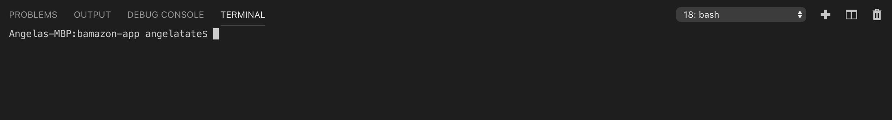
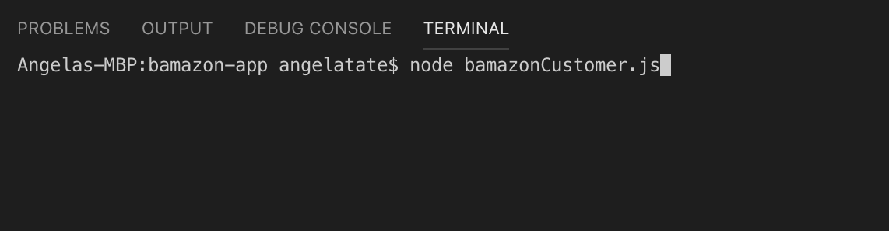
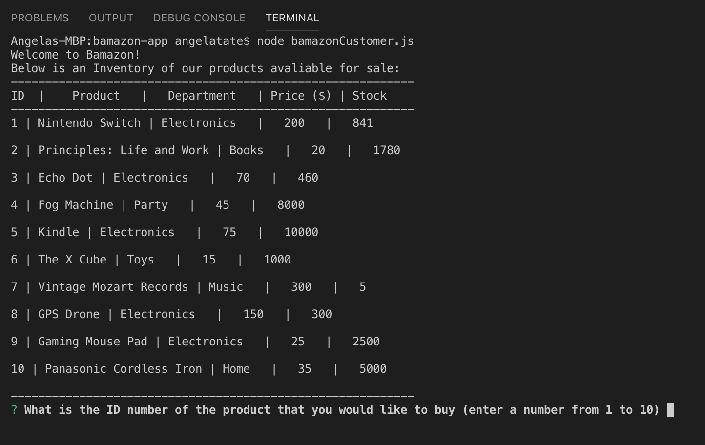
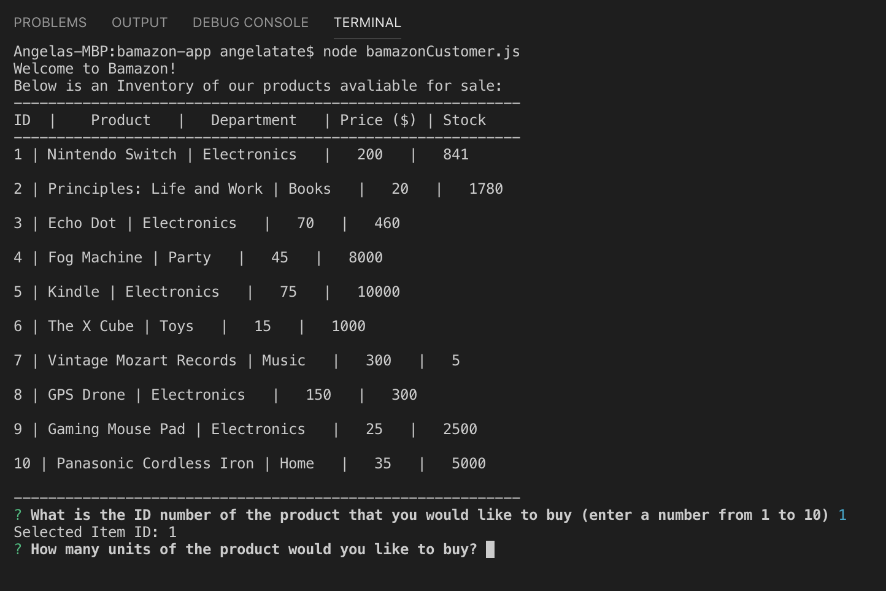
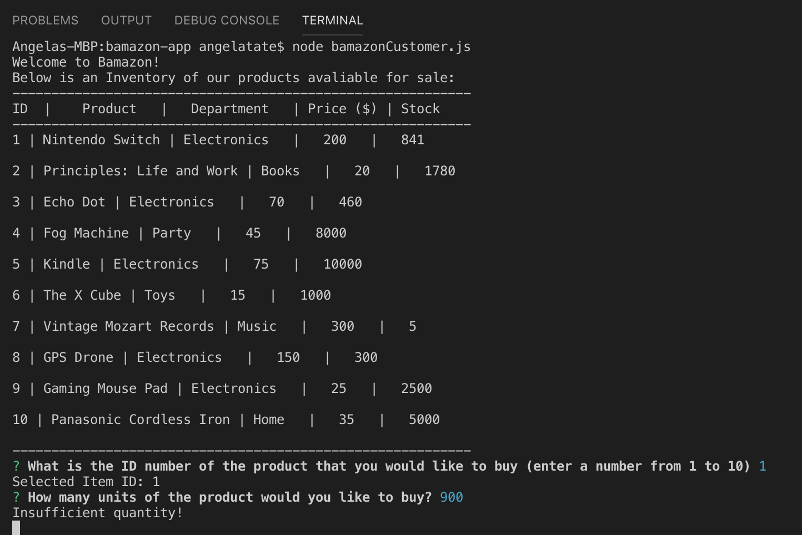
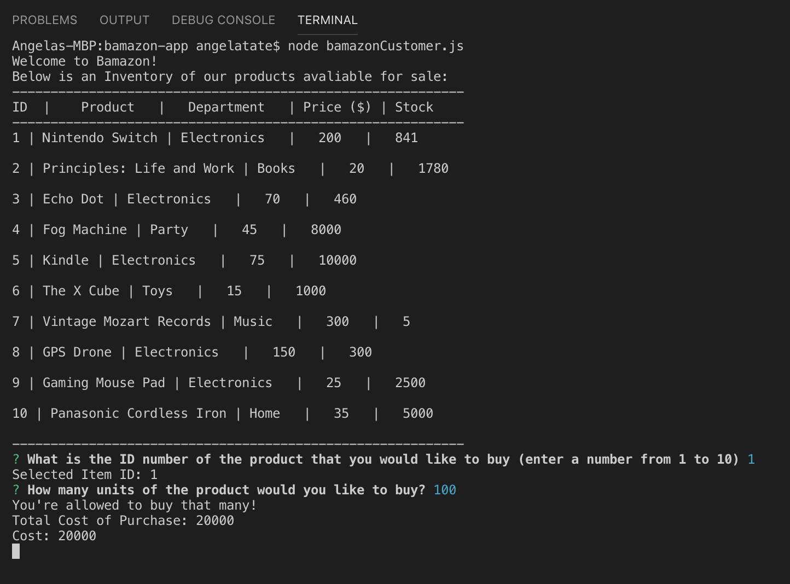

# bamazon-app
Node.js and MySQL, command-line Amazon-like storefront application. 

## Table of contents

* [About this project](#about-this-project)
* [Project requirements](#project-requirements)
* [Live-video](#live)
* [Structure of the project](#structure-of-the-project)
* [Screenshots](#screenshots)
* [Technologies used to create app](#technologies-used)
* [How to use app](#how-to-use)

##  About this project
This project is an Amazon-like storefront with the MySQL skills. The app takes orders from customers and deplete stock from the store's inventory. 

##  Project requirements

<li>Creat a MySQL Database called 'bamazon'</li>
<li>Create a Table inside the of the database called 'products'</li>
<li>The products table includes the following columns</li>
    <ol>item_id</ol>
    <ol>product_name</ol>
    <ol>department_name</ol>
    <ol>price (cost per customer)</ol>
    <ol>stock_quantity</ol>
<li>Populate the database with 10 different products</li> 
<li>Create Node application called 'bamazonCustomer.js'</li>
<li>Display all items avaliable for sale.</li>
<li>The app prompts the user to select the ID of the product</li>
<li>The next prompt asks how many units of the product they would like to buy.</li>
<li>Once Customer places order the application checks if your store has enough of the product to meet the customers request.</li>
<li>If the store does have enough fo the product, you fulfill the customer's order.</li>

##  Live
Video using the app:

##  Structure of the project
<li>README.md</li>
<li>bamazonDB.sql</li>
<li>bamazonCustomer.js</li>
<li>package-lock.json</li>
<li>package.json</li>

##  Screenshots
Images of bamazon-app

##  Technologies used to create the app
<li>MySQL</li>
<li>Node.js</li>
<li>Command-line</li>
<li>Javascript</li>
<li>package-json</li>
<li>node_modules</li>

##  MySQL Database
<li>DROP DATABASE IF EXISTS bamazonDB;</li>
<li>CREATE DATABASE bamazonDB;</li>

<li>USE bamazonDB;</li>

<li>CREATE TABLE products</li>
    <ol>item_id INTEGER AUTO_INCREMENT  NOT NULL,</ol>
    <ol>product_name VARCHAR (50) NOT NULL,</ol>
    <ol>department_name VARCHAR(50) NOT NULL,</ol>
    <ol>price DECIMAL (10,4) NOT NULL,</ol>
    <ol>stock_quantity INTEGER (10) NOT NULL,</ol>
    <ol>primary key (item_id)</ol>

##  How to use app
<li>Navigate to the BAMAZON-APP folder.</li>
<li>In the command-line input 'node bamazonCustomer.js' press enter.</li>
<li>Once the Welcome to Bamazon, displays the products and inventory.</li>
<li>The "What is the ID number of the product that you would like to buy (enter a number from 1 to 10).</li>
<li>The customer then selects the "ID" number desired.</li>
<li>If the quanity is suffienct, the customer will be notified that "You're allowed to buy that many!", The total cost of the purchase.</li>
<li>The inventory is then updated.</li>

